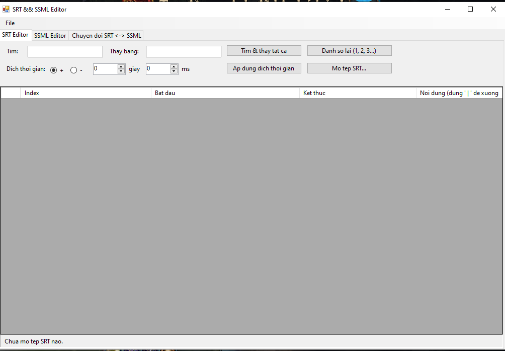

# SrtSsmlEditor
<p align="center">
  
</p

Công cụ GUI viết bằng **VB.NET / WinForms** để chỉnh sửa tệp phụ đề **.srt**
và tệp **.ssml** (Speech Synthesis Markup Language), dựa trên 2 đoạn script
gốc (`VB.Net_Edit_Srt.txt`, `VB.Net_Edit_ssml.txt`) nhưng đóng gói lại thành
một ứng dụng có giao diện, thay vì phải sửa đường dẫn tệp trong code mỗi lần
dùng.

Không cần Visual Studio — build bằng `vbc.exe` có sẵn trong .NET Framework,
giống các tool VB.NET khác (build bằng batch + vbc.exe).

## Cấu trúc project

```
SrtSsmlEditor/
├── Program.vb      ' Điểm vào (Sub Main)
├── MainForm.vb      ' Form chính, 2 tab: SRT Editor / SSML Editor
├── SrtEntry.vb       ' Model 1 mục phụ đề (index, start, end, text)
├── build.bat         ' Script build bằng vbc.exe (không cần Visual Studio)
└── README.md
```

## Yêu cầu

- Windows có sẵn **.NET Framework 4.x** (mặc định có sẵn trên hầu hết máy
  Windows 7 trở lên; `vbc.exe` nằm trong
  `%WINDIR%\Microsoft.NET\Framework64\v4.0.30319\`).
- Không cần cài thêm gì khác (không dùng NuGet package ngoài).

## Cách build

1. Giải nén / copy toàn bộ thư mục `SrtSsmlEditor` ra máy Windows.
2. Chạy `build.bat` (double-click hoặc chạy từ `cmd`).
3. Nếu thành công sẽ có file `SrtSsmlEditor.exe` trong cùng thư mục.

Nếu báo lỗi không tìm thấy `vbc.exe`, mở `build.bat` bằng Notepad và sửa lại
đường dẫn biến `VBC` cho đúng với máy bạn (tìm `vbc.exe` trong
`C:\Windows\Microsoft.NET\Framework\` hoặc `Framework64\`).

## Tính năng

### Tab "SRT Editor"

- **Mở tệp SRT**: đọc và parse tệp `.srt` thành bảng (index, thời gian bắt
  đầu, thời gian kết thúc, nội dung) — sửa trực tiếp trên bảng.
- **Tìm & thay thế tất cả**: thay một đoạn text trong toàn bộ phụ đề.
- **Dịch thời gian (Shift time)**: cộng/trừ toàn bộ mốc thời gian theo số
  giây + mili-giây nhập vào (hữu ích khi phụ đề bị lệch so với video).
- **Đánh số lại**: đánh lại index từ 1 theo thứ tự hiện có trên bảng.
- **Kiểm tra overlap**: rà toàn bộ bảng (theo đúng thứ tự đang có) và liệt kê
  mọi dòng có thời gian bắt đầu nhỏ hơn thời gian kết thúc của dòng trước đó.
- **Tự động sửa overlap**: đẩy thời gian bắt đầu của dòng bị overlap ra sau
  thời gian kết thúc của dòng trước 1ms; nếu overlap quá lớn khiến thời gian
  kết thúc bị nhỏ hơn/bằng thời gian bắt đầu mới, thời gian kết thúc cũng
  được đẩy theo tối thiểu 500ms để tránh thời lượng âm/0. Sau khi sửa, bảng
  được cập nhật ngay — nhớ bấm "Lưu SRT" để ghi lại tệp.
- **Lưu / Lưu thành...**: ghi lại đúng định dạng `.srt` chuẩn.
- Ở cột "Nội dung", nếu phụ đề có nhiều dòng, các dòng được nối bằng
  ` | ` trên bảng — khi lưu sẽ tự tách lại thành nhiều dòng.

### Tab "SSML Editor"

- **Mở / Lưu tệp SSML**: soạn thảo trực tiếp nội dung XML thô (font
  Consolas, có thể sửa tay bất kỳ chỗ nào).
- **Áp dụng cho `<voice>`**: đổi thuộc tính `name` của (các) phần tử
  `<voice>` trong tài liệu.
- **Thêm `<p><s>...</s></p>`**: thêm một câu mới vào cuối tài liệu.
- **Chèn `<break time="...">`**: chèn tag `<break>` tại đúng vị trí con trỏ
  đang đứng trong ô soạn thảo.
- **Bọc `<emphasis level="...">`**: bôi đen một đoạn chữ trong ô soạn thảo
  rồi bấm nút để bọc `<emphasis>` quanh đoạn đó.
- **Định dạng lại XML**: parse lại và in đẹp (indent) toàn bộ tài liệu.

Mọi thao tác cấu trúc (voice, thêm câu, định dạng lại) đều dùng
`System.Xml.XmlDocument` để đảm bảo tệp vẫn là XML hợp lệ sau khi sửa; nếu
tệp đang có lỗi cú pháp XML, ứng dụng sẽ báo lỗi thay vì làm hỏng tệp.

### Tab "Chuyen doi SRT <-> SSML" (mới)

Dùng đúng nội dung đang mở ở 2 tab trên làm nguồn để chuyển đổi qua lại,
kết quả điền thẳng vào tab đích rồi tự chuyển sang tab đó (sau đó dùng nút
"Lưu" ở tab đó như bình thường).

**SRT → SSML**
- Nhập tên `voice` mong muốn (mặc định `en-US-JennyNeural`).
- Mặc định, khoảng lặng `<break>` giữa các câu được tính từ khoảng cách
  thời gian **thực tế** trong SRT (thời điểm kết thúc câu trước → thời điểm
  bắt đầu câu sau) — giúp giữ nhịp gần với video gốc.
- Có thể tick "Dùng khoảng lặng cố định" để bỏ qua thời gian thật và luôn
  chèn một khoảng `<break>` cố định (ms) giữa các câu, giống cách tệp
  `VB.Net_Srt_to_ssml.txt` gốc làm (fixed 500ms).
- Escape ký tự đặc biệt (`<`, `&`, ...) được xử lý tự động qua
  `XmlDocument`, tránh lỗi XML mà bản gốc (ghép chuỗi bằng tay) có thể gặp.

**SSML → SRT**
- SSML không lưu mốc thời gian tuyệt đối cho từng câu, nên thời gian được
  **ước tính**: mỗi `<break time="...">` cộng dồn vào một "đồng hồ" nội bộ,
  còn mỗi `<s>` được gán thời lượng = `max(thời lượng tối thiểu, số ký tự / tốc độ đọc)`.
- Có thể chỉnh "tốc độ đọc" (ký tự/giây, mặc định 15) và "thời lượng tối
  thiểu mỗi câu" (giây, mặc định 1) để kết quả gần với giọng đọc thật hơn.
- Vì đây là ước tính, sau khi chuyển đổi nên rà lại thời gian ở tab SRT
  Editor (dùng chức năng dịch thời gian nếu cần) trước khi dùng cho video
  thật.

## Ghi chú / có thể mở rộng thêm

- Hiện tại SSML được sửa dưới dạng text thô + vài nút thao tác nhanh, chưa
  có cây (TreeView) hiển thị cấu trúc — có thể bổ sung sau nếu cần sửa các
  tài liệu SSML phức tạp, nhiều `<voice>`/`<p>` lồng nhau.
- Chuyển đổi SSML → SRT chỉ đọc các phần tử `<s>` và `<break>` (theo đúng
  cấu trúc mà chức năng SRT → SSML tạo ra); nếu tệp SSML có cấu trúc khác
  (không dùng `<s>`, hoặc chỉ có `<p>` chứa text thẳng) thì cần bổ sung
  thêm logic đọc riêng.
- Có thể thêm chức năng xem trước video + phụ đề, hoặc kiểm tra chồng lấn
  thời gian giữa các dòng phụ đề (overlap check) nếu cần.
